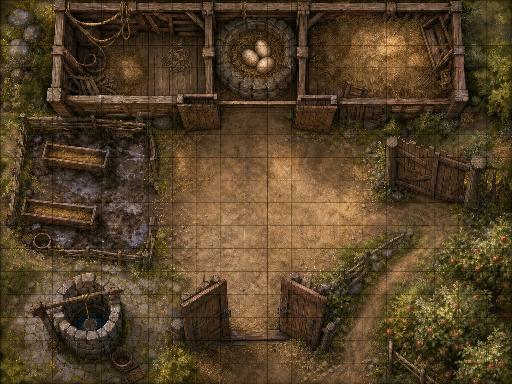
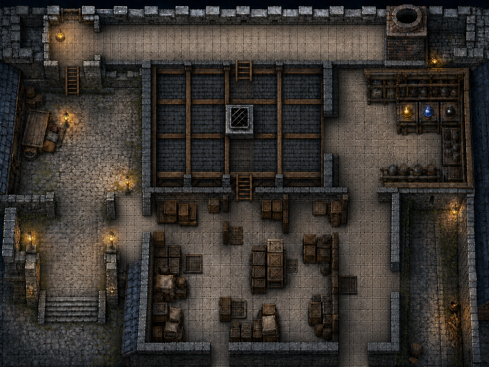
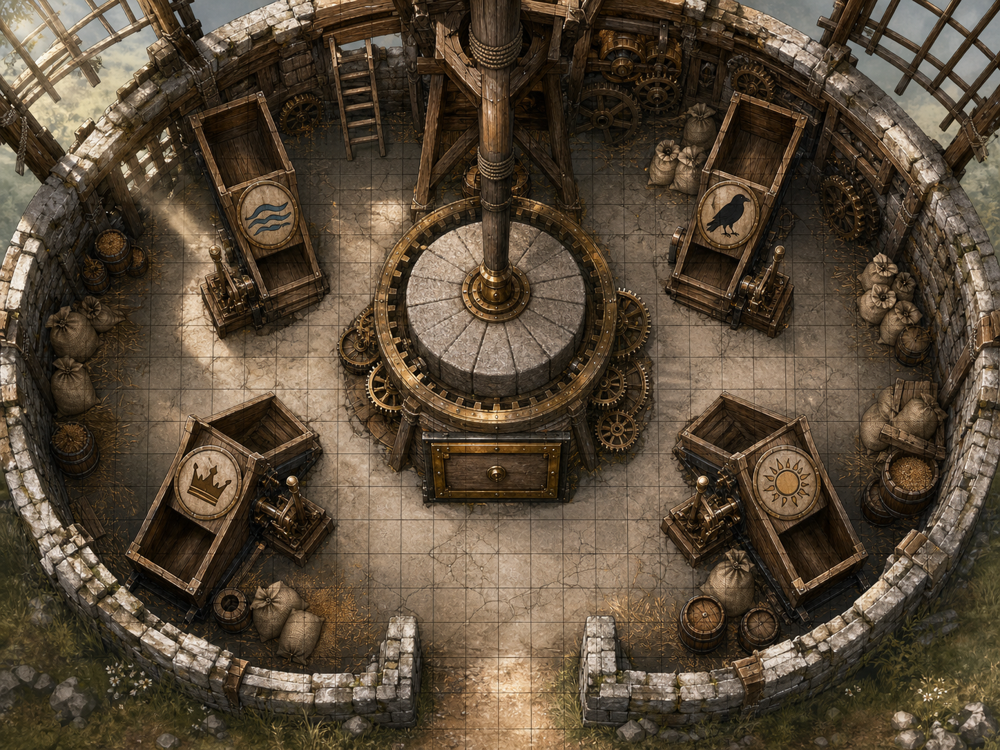
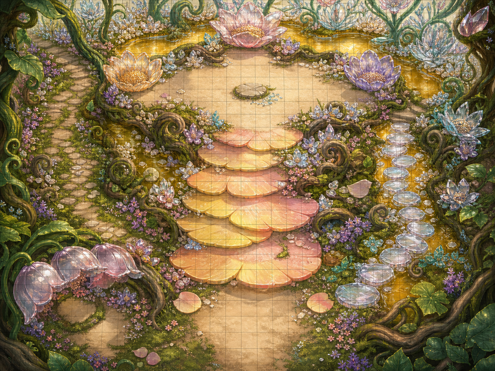
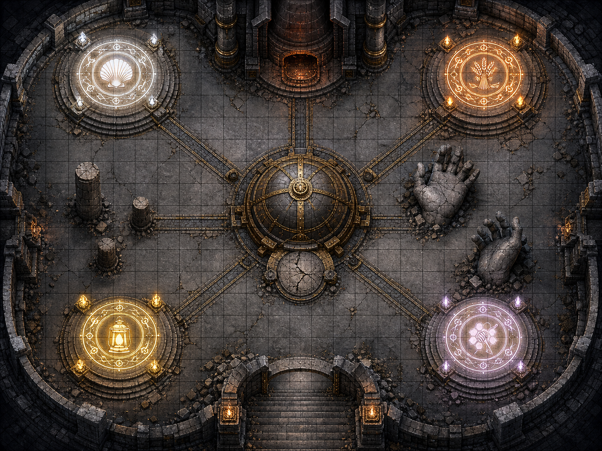

<!-- GitHub-readable edition. For printing and table play, use the release PDFs linked in README.md. -->

**BIRTHDAY QUEST - GAME MASTER'S GUIDE + PLAYER PACK**

# The Lost Celebration of Bellweather

*A fantasy one-shot about rebuilding a forgotten town tradition—without knowing what it will become*

| 3 HEROES | Level 3 QUICK-PLAY | 3½-4½h RUN TIME | Age 13 AGE-TUNED |
| --- | --- | --- | --- |

> THE PROMISE
> Bellweather's grand celebration item was lost generations ago. The heroes must recover four cryptically named components, survive creatures that want the tradition forgotten, and rebuild the mystery beneath a sealed stone dome.

### What is included

1. A complete scene-by-scene mystery quest with read-aloud text and an expected three-and-a-half-to-four-and-a-half-hour run of show.

1. Ingredient hunts featuring battle, stealth, negotiation, and a fail-forward reconstruction finale.

1. Three simplified level 3 heroes: a protector, a sneak, and a starry bard.

1. Printable handouts, official 2024 character sheets, quick rules, keyed maps, tokens, and complete creature stat blocks.

1. Experience, difficulty, and two-player adjustments so the game stays fun rather than fragile.

### Assumptions

This packet uses the 2024 fifth-edition D&D rules for three level 3 heroes and one Game Master. The mystery should feel adventurous rather than childish. Use DC 12 for routine challenges and DC 13 when pressure matters.

> QUICK PERSONALIZE
> Handwrite the birthday hero's name on the commission. Place a covered cake nearby if desired. Players may guess freely; NPCs cannot confirm the answer before the Founder's Hearth opens.

**GM-ONLY SECTION**

## Game Master's Quick Start

You can run the adventure directly from these pages. For each scene: read the boxed text, ask 'What do you do?', let everyone answer, then call for a roll only when failure would be interesting. If you forget a rule, choose DC 12, make a fair ruling, and keep the story moving.

### Before everyone arrives

1. Print the official hero sheets, hero action cards, spell cards, maps, tokens, component cards, loot cards, trackers, and Player Quick Rules page.

1. Gather one d20 per player plus d4, d6, d8, and d10 dice. Cut out the creature, component, reward, Heroic Inspiration, condition, and hearth-rune pieces. Give each player Heroic Inspiration.

1. This age 13 version uses DC 12 for routine checks and DC 13 for risky or dramatic checks. If everyone is new, DC 12 throughout is fine.

1. Privately ask whether anything should stay out of the story. Keep scares cartoony and allow anyone to pause the game without explanation.

1. Let the birthday child choose a hero first. Give the remaining heroes equal chances to solve problems and make decisions.

### Four-hour run of show (expect 3½ to 4½ hours)

| **Time** | **Scene** | **What matters** |
| --- | --- | --- |
| 0:00 | Welcome and hero choice | Introduce characters, explain the d20, and present the restoration tablet. |
| 0:20 | Act 1: Briar Farm | Battle or outwit evil moon-hens to recover the Dawn Pearls. |
| 1:00 | Break 1 / Short Rest | Pause, recap clues, spend Hit Dice, and recover Short Rest features. |
| 1:15 | Act 2A: Storehouse | Sneak past guards or earn their trust to collect Lantern Gold. |
| 2:00 | Act 2B: Mill and Honey Steps | Solve the chute puzzle; bargain or battle for Sunmeal and Cloudsweet. Take Break 2 as a Long Rest after all four components are recovered. |
| 3:15 | Act 3: Founder's Hearth | Combine the components and defend four hearth runes from Cindermaw. |
| 4:20 | Epilogue | Open the dome, reveal the cake, award the Restorer's Medal, and celebrate. |

### The three golden rules

1. Say yes to good ideas. If an action is plausible and fun, let it work or call for a DC 10-13 check.

1. Failure changes the situation; it never stops the adventure. Reveal the clue, but add a cost, complication, or funny consequence.

1. End fights early when the outcome is clear. Enemies surrender, flee, or tumble into harmless feathers and soot at 0 hit points.

> HEROIC INSPIRATION
> Each hero starts with it. Immediately after rolling any die, a hero may expend it to reroll that die and must use the new roll. A hero can have only one Heroic Inspiration at a time.

**GM-ONLY SECTION**

## Secrets, Suspects, and the Lost Recipe

### What really happened

Bellweather once welcomed every new year with a magnificent shared creation, but a fire destroyed the guildhall and its records. Mayor Mallow recovered a coded tablet naming Dawn Pearls, Sunmeal, Lantern Gold, and Cloudsweet. They are eggs, flour, food-grade seed oil, and sugar. Cindermaw was born in the guildhall fire and believes the rekindled hearth will destroy it. Players may guess the answer; NPCs cannot confirm it until the dome opens.

> THE REVEAL
> Use component names, but let players guess freely. NPCs genuinely do not know. A correct prediction earns advantage on one Founder's Hearth check; the magical finished creation remains the true reveal.

### People and creatures

| Name | First impression | What they want / know |
| --- | --- | --- |
| Mayor Mallow | Flustered historian with a soot-marked tablet | Wants the lost tradition restored but cannot read the component names. |
| Captain Wick | Suspicious lamplighter guard with an enormous key ring | Knows brightseed oil is edible; fears thieves are working for Cindermaw. |
| Cindermaw | A coal-black drake leaking sparks and soot | Fears the restored hearth will destroy it. Can become its protector instead. |
| Moon-hens | Goose-sized black chickens with silver combs | Guard the Dawn Pearls; can be calmed with feed, rhythm, or firm handling. |
| Sprig | A brave lantern sprite | Optional helper for two heroes or a struggling party. |

### Clues the heroes cannot miss

1. The Dawn Pearls are warm, speckled, and fiercely guarded by enormous black hens.

1. Lantern Gold is pressed brightseed oil. Captain Wick knows the gold variety is safe for food; the blue and black lamp fuels are dangerous.

1. Sunmeal resembles golden dust and Cloudsweet resembles pale quartz. Smell or taste can reveal more, but never require a player to do so.

1. The reconstruction tablet repeatedly mentions mixing, rising warmth, and a final crown—but never names the object.

### Useful difficulty numbers

| **DC** | **Use it when...** | **Examples** |
| --- | --- | --- |
| 10 | The idea is sensible or the players are younger | Spot an obvious trail, calm a silly creature, leap a short gap. |
| 12 | Default challenge | Notice sootling tracks, calm one hen, identify a marked flask. |
| 13 | The attempt is risky, dramatic, or under time pressure | Cross guarded rafters, solve a rune under pressure, resist Soot Breath. |

**GM-ONLY SECTION**

## Act 1: The Broken Celebration

Goal: introduce the heroes, reveal the missing tradition, and recover Dawn Pearls. Target time: 60 minutes. Take Break 1 as a Short Rest after the tablet points toward the storehouse.

> READ ALOUD
> Bellweather Square should be bursting with music, banners, and cheering. Instead, an empty stone pedestal stands beneath a scorched cloth. Mayor Mallow holds up a cracked tablet. 'Heroes, our oldest celebration has been lost so long that nobody remembers what belongs here. The tablet names four pieces. Recover them before tomorrow's sunset, and perhaps the Founder's Hearth can rebuild what we forgot.'

### Give everyone a spotlight question

1. What strange festival tradition does your hero insist is completely normal?

1. What useful tool did your hero bring that nobody else thought to pack?

1. Why does rebuilding Bellweather's lost celebration matter to your hero?

Reward a confident or funny answer with a cheer. Every hero already begins with Heroic Inspiration, using the standard 2024 rule.

### The mayor's commission

> READ ALOUD
> At Briar Farm, the barn doors explode outward in a cyclone of feathers. Six enormous black chickens patrol a stone nest. Their eyes glow ember-red. One scratches a warning into the dirt: CLUCK OFF. Behind it rest three warm, speckled objects exactly the size of the tablet's first hollow.

### Challenge: Battle the Briar Farm brood

Six magically enraged moon-hens surround a stone nest holding three Dawn Pearls. The group may attempt 4 successes before 2 setbacks or enter combat. In combat, use three hens and the silver-combed rooster; add two hens after round 2 only if the heroes are winning easily. Calming the rooster ends the encounter.

1. Athletics: hold a gate shut, tip a feed trough, or shield an ally from a charging hen.

1. Acrobatics or Stealth: cross the rafters, slip behind the brood, or snatch an egg between patrols.

1. Animal Handling: imitate the old farmer's calming whistle or scatter feed in a safe direction.

1. Investigation or Perception: spot the true nest, the rooster's signal, or a loose fence board.

1. Magic, Performance, or another clever plan: judge by the idea, usually DC 10-13.

> FAIL FORWARD
> On success, the heroes recover the Dawn Pearls cleanly. On a mixed result, they still escape with all three, but a furious rooster follows them and loudly ruins their next attempt at Stealth. Either way, the tablet reveals the clue to Lantern Gold.

### Moon-hen — quick combat

AC 12; HP 7 each; Speed 30 ft.; Initiative +2. Furious Peck: +4 to hit, 1d4 + 2 piercing. Once per round, only the rooster may use Wing Flurry: creatures within 5 ft. make a DC 12 Dex save or take 1d4 + 2 bludgeoning and fall prone. The brood flees when three hens fall or the rooster is calmed with a DC 13 Animal Handling or Performance action.

### First component recovered

The Dawn Pearls reveal the storehouse clue. If the heroes calmed the rooster, give them the Silver Feather loot card: one use causes the Frightened condition to end on every hero. A soot-black drake silhouette watches from a distant chimney, then vanishes.

> READ ALOUD — THE TABLET AWAKENS
> As the third Dawn Pearl settles into the cracked tablet, silver lines race across its surface. A new sentence burns into view: 'Where watchful eyes guard bottled daylight, claim only the gold that may touch a wooden spoon.' Far across Bellweather, the lamplighter tower flashes once—then goes dark. Ask: 'How do you travel there, and who carries the tablet?'

**GM-ONLY SECTION**

## Act 2: Gold Behind Guarded Doors

Goal: expose the impostor, recover Lantern Gold, solve the windmill, and earn Cloudsweet. Target time: 100-120 minutes. Take Break 2 as an eight-hour Long Rest after all four components are recovered; resume at dawn.

> READ ALOUD
> The lamplighter storehouse squats beside the city wall, its windows barred and its roof patrolled. Captain Wick checks Mayor Mallow's seal, then lowers his voice. 'The courtyard is safe. The oil room is not. Sootlings can wear a guard's shape, and one of my people casts no shadow. Go quietly. Find the flask marked with a wooden spoon. Trust nobody carrying blue fire.'

### Scene A: The Lamplighter Storehouse

Run one shared challenge: 3 successes before 2 setbacks. Ask every hero to describe an approach before anyone repeats a skill. OFFICIAL—work beside Wick and test guards; COVERT—use rafters and the roof vent; BAIT—announce a false target and watch who reacts. Routes can be mixed.

1. OFFICIAL: DC 12 Insight, Perception, or Persuasion identifies contradictions, soot tracks, or a missing shadow.

1. COVERT: DC 13 Stealth, Acrobatics, or thieves' tools crosses the rafters, opens the vent, or reaches the oil room unseen.

1. BAIT: DC 12 Deception, Investigation, Performance, or a clever tool use provokes the impostor or identifies the wooden-spoon seal. After every roll, reveal one useful clue.

1. Outcome: at 3 successes, the heroes expose the impostor and preserve Wick's trust. At 2 setbacks, the sootling grabs blue fire and runs; ask every hero for one immediate response. Either way, the correct Lantern Gold is secured. Award Captain's Whistle if no real guard was harmed: once in the finale, one rune is guarded for a full round.

> READ ALOUD — LANTERN GOLD RECOVERED
> The golden flask bears a tiny wooden-spoon seal. When it touches the tablet, the second symbol shines like sunrise through amber glass. Captain Wick exhales. 'That is the true brightseed oil. Whatever you are restoring, Cindermaw is frightened of it.' A new line points toward the abandoned windmill beyond the west gate.

#### Storehouse scuffle — quick combat

Disguised Sootling — AC 13; HP 13; Speed 30 ft., Climb 20 ft.; Initiative +2. Smudging Claw: +4 to hit, 1d6 + 2 Psychic. Blue-Fire Dash (Recharge 5–6): move up to its Speed without provoking Opportunity Attacks. Bellweather Guard — AC 14; HP 11; Spear: +3 to hit, 1d6 + 1 Piercing. Net (1/Day): DC 11 Dexterity save, one Large or smaller creature within 15 feet; failure: Restrained. The target or a creature within 5 feet can take an action and pass a DC 10 Strength (Athletics) check to free it. Real guards prefer nets, Help, and grapples.

> READ ALOUD — IF THE ALARM SOUNDS
> A brass bell CLANGS overhead. Boots pound across the courtyard. One guard smiles far too widely, dissolves into soot, and races for a rack of blue-burning flasks. Captain Wick shouts, 'That one is not mine! Stop it—and keep the blue fire away from the oil!' Ask each player for one immediate action, then roll initiative only if the chase needs it.

> FIRST-TIME GM: RUN THE INFILTRATION
> Track 3 SUCCESS boxes and 2 SETBACK boxes. Ask every hero for an approach before anyone repeats a skill. Nyx can sneak, Bramble can distract, and Elio can question guards. Reveal one clue after every roll. At 3 successes, expose the impostor cleanly. At 2 setbacks, trigger the fleeing sootling. Never block the correct flask.

### Scene B: The Windmill and Honey Steps

> READ ALOUD — THE SILENT WINDMILL
> The abandoned windmill leans over a field of knee-high gold grass. Its sails are perfectly still, but four brass chutes hum beneath the millstone: RAVEN, SUN, RIVER, and CROWN. When the tablet draws near, three carved clues shine along the floor. Somewhere inside the gears, something heavy waits to be released. Ask: 'Who studies the clues, and who checks the machinery?'

At the abandoned mill, four marked chutes—Raven, Sun, River, and Crown—must be opened in order to release the preserved Sunmeal. Read the three carved clues:

> PUZZLE CLUES
> RIVER comes before RAVEN. CROWN stands immediately before SUN. RAVEN is neither first nor last.

Answer: River, Raven, Crown, Sun. A wrong choice releases harmless golden dust and reveals another hint. After two wrong tries, River glows. Solving it without a magical hint awards Millkeeper's Gear: after a failed preparation check, turn that failure into a success.

> READ ALOUD — THE MILL TURNS
> The final chute locks into place. Ancient gears groan, the sails turn despite the still air, and a drawer slides from the millstone. Inside rests a pouch of golden powder marked SUNMEAL. Beneath it is a silver map ending at a stairway of enormous flowers. Tiny winged shapes circle the top. Ask: 'Do you approach openly, hide, or prepare an offering?'

### Cloudsweet encounter

> READ ALOUD — THE SUGAR SPRITES
> The flower stair ends at a garden of glassy blossoms. Three tiny winged figures rise from the petals, each carrying a needle-thin spear. Their leader points at the tablet. 'Ground-walkers took our flowers and never replanted them. Why should we surrender what remembers their sweetness?' Ask: 'What do you say or offer?'

The sprites accept a song, a specific promise to replant their flowers, or a DC 13 Nature, Performance, or Persuasion check. Otherwise, three sprites attack and bargain when two fall. A sincere promise awards Sprite's Favor. With all four components recovered, the heroes camp beneath the sprites' protective flowers for an eight-hour Long Rest and resume at dawn.

> READ ALOUD — CLOUDSWEET EARNED
> The last tiny spear lowers. Whether won through a promise, a performance, or hard-earned respect, the sprites pour pale crystals into a flower-shaped pouch. Their leader says, 'Carry the memory kindly—and bring new flowers when you return.' The crystals settle into the tablet's final hollow. All four symbols pulse together, and golden footprints appear on the road toward the ruined guildhall. For one instant the air smells warm and familiar—but the memory slips away before you can name it.

**GM-ONLY SECTION**

## Act 3: The Founder's Hearth

Goal: solve the Four Channels, operate the hearth as a team, and protect the reconstruction from Cindermaw. Target time: 90-110 minutes including finale and epilogue.

> READ ALOUD
> The Founder's Hearth waits beneath the ruined guildhall. Four stone channels lead toward a sealed iron dome. As the components approach, words ignite across the tablet: WHAT WAKES. WHAT GIVES FORM. WHAT CARRIES WARMTH. WHAT REMEMBERS JOY. From the chimney comes a frightened scraping sound. 'Let forgotten things stay forgotten.'

### Trial 1: The Four Channels

The recovered portions are already magically measured. The heroes connect each to the correct channel using the tablet: 'What wakes enters first. What gives form follows. Warm gold binds what was divided. Memory crowns the work.' Answer: Dawn Pearls, Sunmeal, Lantern Gold, Cloudsweet. After two mistakes, the correct next channel glows.

> READ ALOUD — THE FOUR CHANNELS ANSWER
> The last component slides into place. Silver light races through all four channels—Pearl, Meal, Gold, then Sweet—and the stone hands around the dome unfold with a deep, patient click. Four action symbols flare on the tablet: COMBINE, STIR, WARM, CROWN. Ask the players to arrange those pieces before choosing their stations.

### Trial 2: Operate and Prepare the Hearth

Give out the COMBINE, STIR, WARM, and CROWN pieces. After the heroes identify the order, each takes a station: tablet reader, stone-hand operator, or heat keeper. Each hero makes exactly one DC 13 preparation check; resolve the result only after all three have acted. Do not run a second preparation challenge.

> READ ALOUD — BEGIN THE RECONSTRUCTION
> The stone hands complete their final motion. Beneath the dome, something begins to turn. First comes a soft whisking sound, then a slow golden glow. The four hearth runes ignite around the chamber. From the chimney above, claws scrape against brick. Ask each hero where they stand before the creature arrives.

### The sealed reconstruction dome

> READ ALOUD
> Golden light leaks beneath the sealed dome. The air smells warm, rich, and strangely familiar. Cindermaw crawls headfirst from the chimney, scattering sparks across four glowing runes. 'Stop!' it cries. 'If the old hearth wakes, there will be nowhere left for me!' Two sootlings drop behind it and race toward separate runes. Roll initiative.

### Preparation contributions

Count successes after all three heroes make one DC 13 contribution. Millkeeper's Gear can turn one failed contribution into a success. Do not confirm that the rising mixture is a cake; describe scents, warmth, and golden light.

1. Arcana: stabilize the old hearth's runes.

1. Investigation: align the tablet with the four component channels.

1. Performance: reproduce the rhythm shown by the stone stirring hands.

1. Survival or History: recognize the purpose of controlled heat and careful measures.

1. Any creative action: improvise a missing tool, cool a cracked rune, or protect the covered dome.

> PREPARATION RESULT — RESOLVE AFTER ALL THREE HEROES ACT
> 3 successes: all runes lit; Cindermaw starts at 42 HP.  2 successes: all runes lit; Cindermaw starts at 52 HP.  1 success: one rune starts dark; Cindermaw starts at 52 HP.  0 successes: one rune starts dark and Cindermaw acts first. The reconstruction is never ruined.

**GM-ONLY SECTION**

## Finale: Cindermaw and the Four Hearth Runes

Use the Founder's Hearth map, four rune tokens, two sootlings, Cindermaw, and one progress marker. The heroes win at the end of a round with 3 Reconstruction successes, by reducing Cindermaw to 0 HP, or—after 2 successes and no earlier than round 3—by convincing it that the hearth can become its home.

### Finale rules

> FIRST-TIME GM — RUN EACH ROUND
> 1. Announce lit runes and the hero who may attempt Reconstruction.  2. Let everyone act in initiative order; only one Reconstruction attempt is allowed.  3. A sootling may attack or extinguish a rune.  4. If none does, Cindermaw smothers one unguarded rune.  5. Check victory only after the round ends.
>
> OPTIONAL RUNE POWERS
> PEARL: healing restores +1d4 HP.  MEAL: heroes cannot be pushed or knocked Prone.  GOLD: the first weapon hit each round deals +1d4 Radiant damage.  SWEET: heroes have Advantage on saves to avoid or end the Frightened condition. Use these for the combat-experienced group; omit them if bookkeeping slows play.

1. Only one rune can be extinguished per round in total. A sootling may use Foul Rune; if none does, Cindermaw smothers one unguarded rune at round's end. A hero beside a rune may use an action to relight it or guard it until the hero's next turn.

1. Only one Reconstruction check can be attempted each round, and at least 2 runes must be lit. A hero beside the tablet uses an action for a DC 13 fitting check. A different hero must attempt each round until all three have contributed. Success marks MIX, RISE, or FINISH and relights one rune. Progress never resets.

1. At 2 successes, Radiant Draft activates: Cindermaw takes 2d8 Radiant damage, the Frightened condition ends on every hero, and one extinguished rune relights. At 3 successes, finish the current round; then the dome seals, Cindermaw becomes a Tiny ember-drake, and combat ends.

1. If fewer than 2 runes are lit, Reconstruction cannot be attempted. The townspeople's song relights Pearl at round's end if fewer than 2 remain lit. A hero who expends Heroic Inspiration to reroll a failed Reconstruction check also relights one rune, even if the reroll fails.

1. After 2 Reconstruction successes and no earlier than round 3, a hero can use an action and make a DC 12 Persuasion check to offer Cindermaw a home. On success, finish the current round and then end the fight. When Cindermaw becomes Tiny or reaches 0 HP, ask whether the heroes banish it, let it escape, or appoint it Bellweather's hearth-keeper.

> READ ALOUD — CINDERMAW'S CHOICE
> The ash drake shrinks until it is no larger than a house cat. Its flames dim to a nervous glow. It looks from the bright hearth to the open chimney. 'I thought waking it would put me out,' it whispers. 'Is there room in your celebration for something made from the fire?' Stop reading. Ask the players what they offer, then choose the ending that follows their answer.

### Cindermaw, Ash Drake

Medium Elemental; AC 14; Initiative +3 (13); HP 52 (42 only after 3 preparation successes); Speed 30 ft., Climb 20 ft. Saves: Dex +5, Wis +3. Resistance to Fire damage; Immunity to the Frightened condition.

Cinder Claw. Melee Attack Roll: +5, reach 5 ft. Hit: 7 (1d8 + 3) Fire damage.

Soot Breath (Recharge 5-6). Wisdom Saving Throw: DC 13, each creature in a 15-foot Cone. Failure: 7 (2d6) Psychic damage and Frightened until the end of its next turn. Success: Half damage only.

Up the Chimney! (Reaction, once per round). Trigger: Cindermaw is hit by an attack. Response: it climbs up to 10 feet without provoking Opportunity Attacks.

Tactics. Cindermaw circles the hearth, targets confident heroes with Soot Breath, and commands sootlings to foul separate runes. It never attacks an unconscious hero. Its threats sound frightened: 'If the hearth wakes, where will I go?' Reveal this after round 1 or a successful DC 12 Insight check.

### Sootlings (2)

Tiny elementals; AC 12; HP 5 each; Speed 25 ft., climb 25 ft.; Initiative +2. Smudging Scratch: +4 to hit, 1d4 + 2 psychic damage. Poof! At 0 HP, a sootling bursts into harmless black dust. A hero beside it may catch a golden spark and regain 1d4 HP.

> KEEP IT MOVING
> At the start of each round, announce lit runes, Reconstruction progress, and which hero may contribute next. If the clock slips, after round 3 advance Reconstruction to FINISH following the next successful compassionate or creative action. Finish the current round, then begin the reveal. Never grind through the last few hit points.

**GM-ONLY SECTION**

## Epilogue, Reveal, and Easy Adjustments

### The dome opens

> READ ALOUD
> The four runes blaze white. With a deep stone rumble, the dome rises. Beneath it stands a towering golden cake made from the Dawn Pearls, Sunmeal, Lantern Gold, and Cloudsweet—finished with shimmering decorations formed from the heroes' own magic. Mayor Mallow laughs. 'Bellweather didn't lose a treasure. We lost the recipe for celebrating together!'

Lift a bowl, box, or cloth at the table if you have prepared a real birthday cake. Beneath the stone dome stands an enormous golden cake crowned with candles. Explain how every quest component became part of it. Ask each player to narrate one decoration created by their hero, then let the birthday child name the finished cake.

### Restorer's Medal

Once in a future adventure, the wearer can turn a failed check into a success by explaining what forgotten thing they remembered. Afterward, the medal becomes an ordinary brass gear.

### Difficulty and age dial

| **Group** | **Checks** | **Final encounter** |
| --- | --- | --- |
| New players | Use DC 12; offer a hint after one failed attempt. | Cindermaw HP 44, or 40 after 3 preparation successes; one sootling; Pearl Rune begins guarded. |
| Age 13 / default | Use DC 13 and the printed challenges. | Cindermaw HP 52, or 42 after 3 preparation successes; two sootlings; one rune can be extinguished per round. |
| Experienced players | Use DC 14; add costs on mixed results. | Cindermaw HP 60, or 50 after 3 preparation successes; three sootlings; Gold Rune begins dark. |

### If the table has only two players plus a GM

Each player chooses a hero and starts with Heroic Inspiration. Use Cindermaw at 34 HP with one sootling. Sprig follows them: AC 13, HP 15; Star Bolt +4 to hit, 1d6 + 2 Radiant; Sprig can take the Help action as a Bonus Action.

### Time trims

1. For a two-hour game, make the moon-hen challenge 3 successes before 2 setbacks and remove the sugar-sprite fight.

1. For a ninety-minute game, narrate the Windmill and Honey Steps, then run only the storehouse and Founder's Hearth finale.

1. If any fight runs long, the remaining creatures surrender or bargain as soon as half are defeated and a hero offers terms.

### Closing the session

Award the Restorer's Medal, ask when the players first suspected the answer, and let every hero describe one decoration before the birthday hero names the finished creation.

**GM REFERENCE — EXPECT 3½ TO 4½ HOURS**

**Four-Hour Run Sheet**

| **Clock** | **Scene** | **Target** | **End the scene when...** |
| --- | --- | --- | --- |
| 0:00–0:20 | Bellweather Square | Meet heroes; accept commission | Every hero answers one spotlight question. |
| 0:20–1:00 | Briar Farm | Recover Dawn Pearls | Rooster is calmed or three hens fall. |
| 1:00–1:15 | BREAK 1 / SHORT REST | One-hour story transition; spend Hit Dice | Short Rest features recover; Musician can inspire allies. |
| 1:15–2:00 | Storehouse | Expose impostor; claim Lantern Gold | Correct flask is secured. |
| 2:00–2:30 | Windmill | Solve order; claim Sunmeal | Drawer opens. |
| 2:30–3:00 | Honey Steps | Earn Cloudsweet | Sprites bargain, befriend, or yield. |
| 3:00–3:15 | BREAK 2 / LONG REST | Eight-hour story transition; resume at dawn | HP, Hit Dice, spell slots, and Long Rest features recover. |
| 3:15–3:45 | Hearth Trials | Place components; each hero operates a station | All three preparation contributions are resolved. |
| 3:45–4:20 | Cindermaw Finale | Protect runes; complete or reconcile | Finish the current victory round. |
| 4:20–4:30 | Reveal | Name and celebrate the creation | Every hero adds one decoration. |

> **AT EVERY SCENE**
> 1. State the goal.  2. Describe what is obvious.  3. Ask every player what they do.  4. Roll only when failure changes something.  5. Give the clue or component even after a setback.  6. Announce the next destination.

> **IF THE CLOCK SLIPS**
> Do not remove a puzzle. Shorten combat: enemies bargain after half are defeated; use average damage; skip reinforcements. At the finale, Cindermaw offers terms after the next compassionate action.

**GM REFERENCE — REWARDS & CLUE LADDER**

**Choices That Matter**

| **Scene choice** | **Award** | **Later effect** |
| --- | --- | --- |
| Calm the rooster | Silver Feather | End Frightened on the whole party once. |
| Preserve Captain Wick's trust | Captain's Whistle | Guard one rune for a full round. |
| Solve the mill without magical hint | Millkeeper's Gear | Turn one failed preparation check into a success. |
| Make a sincere promise to sprites | Sprite's Favor | Advantage on first check to reason with Cindermaw. |
| Correctly predict the lost creation | Brilliant Deduction | Advantage on one Founder's Hearth check. |

**Three-Step Hint Ladder**

| **Puzzle** | **Hint 1** | **Hint 2** | **Answer / final rescue** |
| --- | --- | --- | --- |
| Windmill | Which symbol cannot be first? | Place CROWN immediately before SUN. | RIVER, RAVEN, CROWN, SUN. |
| Four Channels | What wakes must enter first. | Warm gold comes after form. | PEARLS, MEAL, GOLD, SWEET. |
| Hearth actions | Warming cannot happen before combining. | The crown must be last. | COMBINE, STIR, WARM, CROWN. |

> **CINDERMAW FORESHADOWING**
> Farm: a drake silhouette watches from a chimney. Storehouse: the impostor gasps, 'The hearth leaves no room for us.' Windmill: soot reads, 'The hearth burns what it cannot remember.' Finale: Cindermaw's first words reveal fear, not hatred.

**OFFLINE BINDER — DO THIS BEFORE PLAY**

**Ten-Minute GM Rehearsal**

| **Minutes** | **Rehearse or prepare** |
| --- | --- |
| 0–2 | Read the Bellweather Square and Briar Farm read-aloud boxes aloud once. |
| 2–4 | Locate the moon-hen, disguised sootling, sprite, sootling, and Cindermaw stat blocks. |
| 4–6 | Lay out the Storehouse zones and practise marking 3 successes / 2 setbacks. |
| 6–8 | Place four rune tokens, MIX / RISE / FINISH, Cindermaw, and two sootlings on the Hearth map. |
| 8–10 | Cover the real cake or reveal prop; rehearse lifting the cover after the final narration. |

**Handout Cue Strip**

| **When** | **Place on the table** |
| --- | --- |
| Hero choice | Sheets 45–50; action cards 41; Elio spell cards 42–43; quick rules 51. |
| Briar Farm | Act 1 handout 28 and player map 32; give the Dawn Pearls card from 30 when recovered. |
| Storehouse / Mill | Act 2 handout 29 and maps 33–34; give Lantern Gold and Sunmeal cards from 30. |
| Honey Steps | Player map 35; give the Cloudsweet card from 30 when earned. |
| Founder's Hearth | Tracker 31, map 36, rune/progress tokens 38, and action/loot cards 40. |

> **BIRTHDAY & FOOD CHECK**
> Privately confirm allergies, dietary needs, candles, and serving plans with a parent or guardian. Keep food packaging, scent, and the covered cake away from the play table so they do not reveal the mystery.

> **SPOTLIGHT RULE**
> At every challenge, ask all three players what they intend to do before resolving the first roll. Everyone acts before anyone repeats a skill or station.

> **REST RESET**
> BREAK 1 / SHORT REST: spend Hit Point Dice; recover Short Rest features; Elio's Musician feat can grant Heroic Inspiration.
> BREAK 2 / LONG REST: restore HP, Hit Point Dice, spell slots, and Long Rest features; resume at dawn.

> **EMERGENCY FINISH**
> If time runs short after round 3 of the finale, the next successful compassionate or creative action advances Reconstruction to FINISH. Complete that round, then begin the reveal.

**GM REFERENCE — STOREHOUSE & HEARTH**

**Challenge Procedures**

**Storehouse: 3 Successes Before 2 Setbacks**

| **Route** | **Suggested checks** | **A success reveals...** |
| --- | --- | --- |
| OFFICIAL | DC 12 Insight, Perception, Persuasion | A contradiction, soot trail, or missing shadow. |
| COVERT | DC 13 Stealth, Acrobatics, thieves' tools | A safe path through rafters or the roof vent. |
| BAIT | DC 12 Deception, Investigation, Performance | The impostor's reaction or wooden-spoon seal. |

> **STOREHOUSE OUTCOME**
> 3 successes: expose the impostor cleanly and preserve Wick's trust. 2 setbacks: trigger the blue-fire chase. Either result secures Lantern Gold. Award the Whistle if no real guard was harmed.

**Hearth Preparation: One Check Per Hero**

| **Successes** | **Finale setup** |
| --- | --- |
| 3 | All runes lit; Cindermaw starts at 42 HP. |
| 2 | All runes lit; Cindermaw starts at 52 HP. |
| 1 | One rune dark; Cindermaw starts at 52 HP. |
| 0 | One rune dark; Cindermaw acts first. |

> **MILLKEEPER'S GEAR**
> After all three heroes contribute, convert one failed preparation check into a success. Resolve the row above only after every hero has acted.

**GM REFERENCE — KEEP VISIBLE**

**Finale Dashboard & Initiative Strips**

> **PLAYER VICTORY CARD**
> KEEP AT LEAST 2 RUNES LIT.
> Complete MIX, RISE, and FINISH.
> Only one different hero attempts Reconstruction each round.
> After 2 successes and during round 3 or later, Cindermaw can be offered a home.
> Victory takes effect after everyone finishes the current round.

| **Round** | **Lit runes** | **Hero attempting Reconstruction** | **Progress / result** |
| --- | --- | --- | --- |
| 1 | P __  M __  G __  S __ | ________________________ | ________________ |
| 2 | P __  M __  G __  S __ | ________________________ | ________________ |
| 3 | P __  M __  G __  S __ | ________________________ | ________________ |
| 4 | P __  M __  G __  S __ | ________________________ | ________________ |
| 5 | P __  M __  G __  S __ | ________________________ | ________________ |

**Initiative Strips — Cut Apart**

| BRAMBLE | NYX | ELIO | CINDERMAW |
| --- | --- | --- | --- |
| MOON-HENS | DISGUISED SOOTLING | SUGAR SPRITES | SOOTLINGS |

*✂  Cut on the cell borders and arrange the strips in initiative order.*

**GM REFERENCE — KEYED LOCATIONS**

**GM Map Key: Briar Farm**

> **RUNNING NOTES**
> On the illustrated map, 1 square equals 5 feet; use normal movement. Secret: feed in B3 grants Advantage to calm the rooster. Reinforcements enter from B9 only if the heroes dominate the first two rounds.

| B1 RAFTERS DC 12 climb | B2 STONE NEST Dawn Pearls | B3 HAYLOFT hidden feed |
| --- | --- | --- |
| B4 TROUGHS difficult terrain | B5 FARMYARD rooster + 3 hens | B6 SIDE GATE DC 12 latch |
| B7 OLD WELL Half Cover | B8 BARN DOORS heroes enter | B9 ORCHARD optional reinforcements |

**GM REFERENCE — KEYED LOCATIONS**

**GM Map Key: Storehouse**

> **RUNNING NOTES**
> On the illustrated map, 1 square equals 5 feet; use normal movement. The disguised sootling begins in S8, casts no shadow, and flees through S9 after two setbacks. The S5 roof vent opens toward S6.

| S1 CITY WALL watch post | S2 ROOF WALK real guard | S3 CHIMNEY soot clue |
| --- | --- | --- |
| S4 COURTYARD Captain Wick | S5 RAFTERS DC 13 crossing | S6 OIL ROOM wooden-spoon seal |
| S7 FRONT GATE official route | S8 SUPPLY HALL impostor begins | S9 ALLEY EXIT chase route |

**GM REFERENCE — KEYED LOCATIONS**

**GM Map Key: Founder's Hearth**

> **RUNNING NOTES**
> On the illustrated map, 1 square equals 5 feet; use normal movement. Start sootlings at H1 and H3, Cindermaw at H2, and heroes at H8. Only one rune can be extinguished each round.

| H1 PEARL RUNE | H2 CHIMNEY Cindermaw | H3 MEAL RUNE |
| --- | --- | --- |
| H4 PILLARS Half Cover | H5 DOME / TABLET Reconstruction | H6 STONE HANDS Half Cover |
| H7 GOLD RUNE | H8 ENTRY heroes | H9 SWEET RUNE |

**GM REFERENCE — DO NOT GIVE TO PLAYERS**

**NPC & Creature Stat Blocks**

> **HOW TO USE THESE**
> Each block contains everything needed at the table. Mark current HP beside the printed maximum. For a faster game, use average damage instead of rolling. Creatures flee, surrender, or become harmless when the story says the encounter is over.

**Mayor Mallow**

*Medium humanoid (human), neutral good*

**Armor Class 10  •  Initiative +0 (10)  •  Hit Points 9 (2d8)  •  Speed 30 ft.**

| **STR** | **DEX** | **CON** | **INT** | **WIS** | **CHA** |
| --- | --- | --- | --- | --- | --- |
| 10 (+0) | 10 (+0) | 10 (+0) | 14 (+2) | 13 (+1) | 15 (+2) |

Skills History +4, Persuasion +4  •  Senses passive Perception 11  •  Languages Common, Dwarvish  •  Challenge 0 (10 XP; PB +2)

**Town Historian.** Mayor Mallow has Advantage on Intelligence (History) checks about Bellweather.

**Actions**

**Walking Stick.** Melee Attack Roll: +2, reach 5 ft. Hit: 2 (1d4) Bludgeoning damage.

**Rallying Word (1/Day).** One creature within 30 feet gains 5 Temporary Hit Points.

**Captain Wick**

*Medium humanoid (human), lawful good*

**Armor Class 16 (chain shirt, shield)  •  Initiative +1 (11)  •  Hit Points 27 (5d8+5)  •  Speed 30 ft.**

| **STR** | **DEX** | **CON** | **INT** | **WIS** | **CHA** |
| --- | --- | --- | --- | --- | --- |
| 14 (+2) | 12 (+1) | 12 (+1) | 11 (+0) | 14 (+2) | 13 (+1) |

Skills Insight +4, Investigation +2, Perception +4  •  Senses passive Perception 14  •  Languages Common  •  Challenge 1 (200 XP; PB +2)

**Watch Captain.** Friendly guards within 30 feet have Advantage on saves to avoid or end the Frightened condition.

**Actions**

**Multiattack.** Wick makes two Spear attacks.

**Spear.** Melee or Ranged Attack Roll: +4, reach 5 ft. or range 20/60 ft. Hit: 5 (1d6 + 2) Piercing damage.

**Net (1/Day).** Dexterity Saving Throw: DC 11, one Large or smaller creature within 15 feet. Failure: the target has the Restrained condition. The target or a creature within 5 feet of it can take an action and make a DC 10 Strength (Athletics) check, freeing the target on a success.

**GM REFERENCE**

**NPC & Creature Stat Blocks — Continued**

**Bellweather Guard**

*Medium humanoid (any ancestry), any lawful alignment*

**Armor Class 14 (leather, shield)  •  Initiative +1 (11)  •  Hit Points 11 (2d8+2)  •  Speed 30 ft.**

| **STR** | **DEX** | **CON** | **INT** | **WIS** | **CHA** |
| --- | --- | --- | --- | --- | --- |
| 13 (+1) | 12 (+1) | 12 (+1) | 10 (+0) | 11 (+0) | 10 (+0) |

Skills Perception +2  •  Senses passive Perception 12  •  Languages Common  •  Challenge 1/8 (25 XP; PB +2)

**Nonlethal Training.** A guard reduced to 0 HP during this adventure is knocked unconscious and stable.

**Actions**

**Spear.** Melee or Ranged Attack Roll: +3, reach 5 ft. or range 20/60 ft. Hit: 4 (1d6 + 1) Piercing damage.

**Net (1/Day).** Dexterity Saving Throw: DC 11, one Large or smaller creature within 15 feet. Failure: the target has the Restrained condition. The target or a creature within 5 feet of it can take an action and make a DC 10 Strength (Athletics) check, freeing the target on a success.

**Moon-Hen**

*Small beast, unaligned*

**Armor Class 12  •  Initiative +2 (12)  •  Hit Points 7 (2d6)  •  Speed 30 ft., fly 10 ft.**

| **STR** | **DEX** | **CON** | **INT** | **WIS** | **CHA** |
| --- | --- | --- | --- | --- | --- |
| 8 (-1) | 14 (+2) | 10 (+0) | 3 (-4) | 12 (+1) | 7 (-2) |

Skills Perception +3  •  Senses passive Perception 13  •  Languages —  •  Challenge 1/8 (25 XP; PB +2)

**Flock Fury.** The moon-hen has Advantage on an attack roll if another moon-hen is within 5 feet of the target.

**Actions**

**Furious Peck.** Melee Attack Roll: +4, reach 5 ft. Hit: 4 (1d4 + 2) Piercing damage.

**Wing Flurry (Rooster Only; 1/Round).** Dexterity Saving Throw: DC 12, each creature within 5 feet. Failure: 4 (1d4 + 2) Bludgeoning damage, and the target has the Prone condition.

**GM REFERENCE**

**NPC & Creature Stat Blocks — Continued**

**Disguised Sootling**

*Small elemental, chaotic neutral*

**Armor Class 13  •  Initiative +2 (12)  •  Hit Points 13 (3d6+3)  •  Speed 30 ft., climb 20 ft.**

| **STR** | **DEX** | **CON** | **INT** | **WIS** | **CHA** |
| --- | --- | --- | --- | --- | --- |
| 8 (-1) | 14 (+2) | 12 (+1) | 9 (-1) | 11 (+0) | 12 (+1) |

Skills Deception +3, Stealth +4  •  Damage Resistances fire  •  Senses darkvision 60 ft., passive Perception 10  •  Languages understands Common  •  Challenge 1/4 (50 XP; PB +2)

**False Appearance.** While motionless in guard form, the sootling is indistinguishable from a guard except that it casts no shadow and leaves soot tracks.

**Soot Shape.** As a Bonus Action, it changes between its soot form and one humanoid disguise.

**Actions**

**Smudging Claw.** Melee Attack Roll: +4, reach 5 ft. Hit: 5 (1d6 + 2) Psychic damage.

**Blue-Fire Dash (Recharge 5–6).** The sootling moves up to its Speed without provoking Opportunity Attacks.

**Sugar Sprite**

*Tiny fey, chaotic good*

**Armor Class 13  •  Initiative +3 (13)  •  Hit Points 4 (3d4-3)  •  Speed 10 ft., fly 30 ft.**

| **STR** | **DEX** | **CON** | **INT** | **WIS** | **CHA** |
| --- | --- | --- | --- | --- | --- |
| 4 (-3) | 16 (+3) | 9 (-1) | 11 (+0) | 13 (+1) | 14 (+2) |

Skills Nature +2, Performance +4  •  Senses passive Perception 11  •  Languages Common, Sylvan  •  Challenge 1/4 (50 XP; PB +2)

**Flower Step.** Opportunity attacks against the sprite are made with disadvantage while it is within 5 ft. of a plant.

**Actions**

**Sugar Sting.** Melee or Ranged Attack Roll: +5, reach 5 ft. or range 20/60 ft. Hit: 5 (1d4+3) Piercing damage.

**Blinding Glitter (Recharge 6).** Constitution Saving Throw: DC 12, one creature within 20 feet. Failure: the target has the Blinded condition until the start of the sprite's next turn.

**GM REFERENCE**

**NPC & Creature Stat Blocks — Continued**

**Sootling**

*Tiny elemental, chaotic neutral*

**Armor Class 12  •  Initiative +2 (12)  •  Hit Points 5 (2d4)  •  Speed 25 ft., climb 25 ft.**

| **STR** | **DEX** | **CON** | **INT** | **WIS** | **CHA** |
| --- | --- | --- | --- | --- | --- |
| 6 (-2) | 14 (+2) | 10 (+0) | 7 (-2) | 10 (+0) | 8 (-1) |

Damage Resistances fire  •  Senses darkvision 60 ft., passive Perception 10  •  Languages understands Ignan  •  Challenge 1/8 (25 XP; PB +2)

**Poof! When reduced to 0 HP, the sootling bursts harmlessly.** One creature within 5 ft. can catch its spark and regain 1d4 HP.

**Actions**

**Smudging Scratch.** Melee Attack Roll: +4, reach 5 ft. Hit: 4 (1d4 + 2) Psychic damage.

**Foul Rune.** The sootling extinguishes one unguarded hearth rune within 5 feet.

**Cindermaw, Ash Drake**

*Medium elemental, chaotic neutral*

**Armor Class 14  •  Initiative +3 (13)  •  Hit Points 52 (8d8+16)  •  Speed 30 ft., climb 20 ft.**

| **STR** | **DEX** | **CON** | **INT** | **WIS** | **CHA** |
| --- | --- | --- | --- | --- | --- |
| 14 (+2) | 16 (+3) | 14 (+2) | 9 (-1) | 12 (+1) | 13 (+1) |

Saving Throws Dex +5, Wis +3  •  Skills Acrobatics +5, Insight +3  •  Damage Resistances fire  •  Condition Immunities frightened  •  Senses darkvision 60 ft., passive Perception 11  •  Languages Common, Ignan  •  Challenge 2 (450 XP; PB +2)

**Hearthbound.** If no sootling used Foul Rune this round, Cindermaw extinguishes one lit, unguarded rune at round's end. Only one rune can be extinguished per round.

**Fear of Extinction.** After 2 Reconstruction successes and no earlier than round 3, a creature can use an action and succeed on a DC 12 Charisma (Persuasion) check to offer Cindermaw a home. The fight ends after the current round.

**Actions**

**Cinder Claw.** Melee Attack Roll: +5, reach 5 ft. Hit: 7 (1d8 + 3) Fire damage.

**Soot Breath (Recharge 5–6).** Wisdom Saving Throw: DC 13, each creature in a 15-foot Cone. Failure: 7 (2d6) Psychic damage, and the target has the Frightened condition until the end of its next turn. Success: Half damage only.

**Reactions**

**Up the Chimney.** Trigger: Cindermaw is hit by an attack. Response: Cindermaw climbs up to 10 feet without provoking Opportunity Attacks.

**Sprig, Lantern Sprite**

*Tiny fey, neutral good*

**Armor Class 13  •  Initiative +3 (13)  •  Hit Points 15 (6d4)  •  Speed 10 ft., fly 30 ft.**

| **STR** | **DEX** | **CON** | **INT** | **WIS** | **CHA** |
| --- | --- | --- | --- | --- | --- |
| 5 (-3) | 16 (+3) | 10 (+0) | 12 (+1) | 14 (+2) | 13 (+1) |

Skills Perception +4  •  Damage Resistances radiant  •  Senses darkvision 60 ft., passive Perception 14  •  Languages Common, Sylvan  •  Challenge 1/4 (50 XP; PB +2)

**Helpful Light.** Sprig can take the Help action as a Bonus Action.

**Actions**

**Star Bolt.** Ranged Spell Attack Roll: +4, range 60 ft. Hit: 5 (1d6 + 2) Radiant damage.

**Kindle (1/Day).** Sprig relights one hearth rune within 30 feet.

**PLAYER HANDOUT — OPENING**

**Bellweather Restoration Commission**

> **OFFICIAL COMMISSION**
> Birthday Hero: ________________________________
> Recover DAWN PEARLS, SUNMEAL, LANTERN GOLD, and CLOUDSWEET. Their purpose is unknown. Return all four to the Founder's Hearth before tomorrow's sunset.

**Restoration Tablet**

| **Component** | **Recovered** | **What We Learned** | **Who Carries It** |
| --- | --- | --- | --- |
| DAWN PEARLS | □ | ____________________________ | ____________ |
| LANTERN GOLD | □ | ____________________________ | ____________ |
| SUNMEAL | □ | ____________________________ | ____________ |
| CLOUDSWEET | □ | ____________________________ | ____________ |

> **HEROIC INSPIRATION — 2024 CORE RULE**
> Each hero starts with Heroic Inspiration. Immediately after rolling any die, expend it to reroll that die; you must use the new roll. A hero can have only one Heroic Inspiration at a time.

**PLAYER HANDOUT**

**Act 1: Briar Farm**

> **WHAT YOU SEE**
> BARN RAFTERS — loose ropes, hanging tools, and a path above the brood.
> FARMYARD — six moon-hens, scattered feed, and a furious silver-combed rooster.
> STONE NEST — three warm Dawn Pearls.
> SIDE GATE — warped boards and a rusty latch.

**Our Plan**

| **Hero** | **Position or Approach** | **What Could Help** |
| --- | --- | --- |
| Bramble |  |  |
| Nyx |  |  |
| Elio |  |  |

**Clue Revealed by the Tablet**

> **BOTTLED DAYLIGHT**
> WHERE WATCHFUL EYES GUARD BOTTLED DAYLIGHT, CLAIM ONLY THE GOLD THAT MAY TOUCH A WOODEN SPOON.

**PLAYER HANDOUT**

**Act 2: Storehouse & Windmill**

**Storehouse Infiltration**

| **Zone** | **What We Know** | **Hero / Result** |
| --- | --- | --- |
| COURTYARD | Captain Wick admits the commission—but not every guard is real. | ________________ |
| RAFTERS | A roof vent overlooks the locked oil room. | ________________ |
| OIL ROOM | Gold, blue, and black flasks; only one bears a wooden-spoon seal. | ________________ |

> **SUSPECT CLUES**
> □ Casts no shadow    □ Leaves soot tracks    □ Carries blue fire    □ Knows the wooden-spoon seal

**Windmill Chute Puzzle**

> **CARVED CLUES**
> RIVER comes before RAVEN.
> CROWN stands immediately before SUN.
> RAVEN is neither first nor last.
> Open:  1) __________  2) __________  3) __________  4) __________

**PLAYER HANDOUT — CUT APART IF DESIRED**

**Recovered Component Cards**

> **DAWN PEARLS**
> Warm, speckled, and protected by the Briar Farm brood.
> Carrier: _______________________

✂  - - - - - - - - - - - - - - - - - - - - - - - - - - - - - - -

> **LANTERN GOLD**
> A golden brightseed flask bearing a wooden-spoon seal.
> Carrier: _______________________

✂  - - - - - - - - - - - - - - - - - - - - - - - - - - - - - - -

> **SUNMEAL**
> Golden powder released by the abandoned windmill.
> Carrier: _______________________

✂  - - - - - - - - - - - - - - - - - - - - - - - - - - - - - - -

> **CLOUDSWEET**
> Pale crystals carrying the memory of flowers.
> Carrier: _______________________

✂  - - - - - - - - - - - - - - - - - - - - - - - - - - - - - - -

**PLAYER HANDOUT**

**Act 3: Founder's Hearth Tracker**

**Four Channels**

> **TABLET INSCRIPTION**
> WHAT WAKES ENTERS FIRST.
> WHAT GIVES FORM FOLLOWS.
> WARM GOLD BINDS WHAT WAS DIVIDED.
> MEMORY CROWNS THE WORK.

**Hearth Runes**

| **Rune** | **Lit?** | **Power While Lit** | **Guarded By** |
| --- | --- | --- | --- |
| PEARL | ● / ○ | Healing restores +1d4 HP. | ____________ |
| MEAL | ● / ○ | Heroes cannot be pushed or knocked prone. | ____________ |
| GOLD | ● / ○ | First weapon hit each round deals +1d4 radiant. | ____________ |
| SWEET | ● / ○ | Advantage on saves to avoid or end Frightened. | ____________ |

**Reconstruction Progress**

| **1 — MIX** | **2 — RISE** | **3 — FINISH** |
| --- | --- | --- |
| □ | □  Radiant Draft! | □  Open the dome |

> **FINALE VICTORY RULES**
> Keep at least 2 runes lit. Only one different hero attempts Reconstruction each round. After 2 successes and during round 3 or later, you may offer Cindermaw a home. Victory takes effect after the current round ends.

## Illustrated Player Maps

These are the player-safe maps used by the printable release. On tactical maps, 1 square equals 5 feet; the Windmill is a puzzle diagram with no tactical scale.

**CUT-OUT SHEET — PRINT ON CARDSTOCK IF POSSIBLE**

**Creature Tokens**

| BRAMBLE HERO | NYX HERO | ELIO HERO | CINDERMAW ASH DRAKE |
| --- | --- | --- | --- |
| ROOSTER MOON-HEN | MOON-HEN 1 | MOON-HEN 2 | MOON-HEN 3 |
| MOON-HEN 4 | MOON-HEN 5 | SOOTLING 1 | SOOTLING 2 |
| SOOTLING 3 optional | SUGAR SPRITE 1 | SUGAR SPRITE 2 | SUGAR SPRITE 3 |

*Cut along the cell borders. Fold each token or place it beneath a coin or spare miniature.*

**CUT-OUT SHEET**

**Rune, Progress & Heroic Inspiration Tokens**

| PEARL RUNE LIT | MEAL RUNE LIT | GOLD RUNE LIT | SWEET RUNE LIT |
| --- | --- | --- | --- |
| PEARL RUNE DARK | MEAL RUNE DARK | GOLD RUNE DARK | SWEET RUNE DARK |
| MIX 1 SUCCESS | RISE 2 SUCCESSES | FINISH 3 SUCCESSES | ROUND 1 • 2 • 3 • 4 • 5 |
| HEROIC INSPIRATION BRAMBLE | HEROIC INSPIRATION NYX | HEROIC INSPIRATION ELIO | GOLDEN SPARK HEAL 1d4 |

**CUT-OUT SHEET — 2024 CONDITIONS**

**Condition & Combat Tokens**

| BLINDED | FRIGHTENED | PRONE | RESTRAINED |
| --- | --- | --- | --- |
| POISONED | INCAPACITATED | UNCONSCIOUS | CONCENTRATION |
| ADVANTAGE | DISADVANTAGE | HALF COVER +2 AC / DEX | THREE-QUARTERS +5 AC / DEX |
| BLOODIED Half HP | HELPED | HIDDEN | REACTION USED |

**CUT-OUT SHEET**

**Hearth Action Pieces & Loot Cards**

> **COMBINE**
> Bring separate components together.

> **STIR**
> Set the joined mixture into motion.

> **WARM**
> Wake the controlled hearth.

> **CROWN**
> Finish with remembered joy.

> **SILVER FEATHER**
> One use: end Frightened on the whole party.

> **CAPTAIN'S WHISTLE**
> One use in finale: guard one rune for a full round.

> **MILLKEEPER'S GEAR**
> Turn one failed preparation check into a success.

> **SPRITE'S FAVOR**
> Advantage on first attempt to reason with Cindermaw.

**CUT INTO THREE CARDS — ONE PER PLAYER**

**Hero Action Cards**

> **BRAMBLE — 2024 CHAMPION**
> ATTACK: Longsword +5, 1d8+3 Slashing. Sap: the target has Disadvantage on its next attack before your next turn.
> SECOND WIND (Bonus Action, 2 uses): regain 1d10+3 HP. Recover 1 use on a Short Rest and all on a Long Rest.
> TACTICAL MIND: after a failed ability check, spend Second Wind and add 1d10; if it still fails, the use is not spent.
> PROTECTION (Reaction): while holding a shield, protect an ally within 5 feet; the triggering and later attacks against that ally have Disadvantage until the start of your next turn while you remain within 5 feet.
> ACTION SURGE: one extra action, except the Magic action. Javelin Slow reduces Speed 10 feet; Warhammer Push moves a Large or smaller target up to 10 feet away.

> **NYX — 2024 THIEF**
> ATTACK: Shortbow +5, 1d6+3 Piercing. Vex: after a hit that deals damage, gain Advantage on your next attack against that target before the end of your next turn.
> SNEAK ATTACK: add 2d6 once per turn with Advantage, or while a conscious ally is within 5 feet of the target and you lack Disadvantage.
> CUNNING ACTION (Bonus Action): Dash, Disengage, or Hide. STEADY AIM: if you have not moved, gain Advantage on your next attack this turn and then Speed 0 for the turn.
> FAST HANDS (Bonus Action): pick a lock, disarm a trap, pick a pocket, take the Utilize action, or use a magic item that requires the Magic action. SECOND-STORY WORK: Climb Speed 30 feet; use Dexterity for jump distance.
> DAGGER NICK: make the Light weapon extra attack inside the Attack action instead of as a Bonus Action, once per turn. ALERT: Initiative +5; may swap with a willing ally.

> **ELIO — 2024 LORE BARD**
> BARDIC INSPIRATION (Bonus Action, 3 uses): an ally within 60 feet who sees or hears you gains a d6 for 1 hour; after failing a D20 Test, they add it and might succeed. Recover all uses on a Long Rest.
> CUTTING WORDS (Reaction): when a visible creature within 60 feet deals damage or succeeds on an attack roll or ability check, spend a Bardic Inspiration die and subtract the d6.
> MUSICIAN: after a Short or Long Rest, grant Heroic Inspiration to up to two allies.
> CANTRIP: Vicious Mockery, DC 13 Wisdom save, 1d6 Psychic. HEALING WORD (Bonus Action): 2d4+3 HP with a level-1 slot.
> SPELLS: save DC 13; attack +5. Track four level-1 and two level-2 slots.

**PLAYER REFERENCE — CARDS 1–5**

**Elio's Spell Cards**

*An asterisk marks a spell granted by Elio's High Elf lineage rather than his Bard class.*

> **MAGE HAND**
> Conjuration cantrip • Action • 30 ft. • V, S • 1 minute
> Create a spectral hand that manipulates an unattended object. It can't attack, activate magic items, or carry more than 10 pounds.

✂  - - - - - - - - - - - - - - - - - - - - - - - - - - -

> **VICIOUS MOCKERY**
> Enchantment cantrip • Action • 60 ft. • V • Instantaneous
> Wisdom save DC 13. Failure: 1d6 Psychic damage and Disadvantage on the target's next attack before its next turn ends.

✂  - - - - - - - - - - - - - - - - - - - - - - - - - - -

> **PRESTIDIGITATION\***
> High Elf lineage • Transmutation cantrip • Action • 10 ft. • V, S • Instantaneous or up to 1 hour
> Create a harmless magical trick: a brief sensory effect, a small flame, cleaning or soiling, warming, chilling, flavoring, a temporary mark, or a tiny trinket. You can maintain up to three ongoing effects.

✂  - - - - - - - - - - - - - - - - - - - - - - - - - - -

> **HEALING WORD**
> Level 1 Abjuration • Bonus Action • 60 ft. • V • Instantaneous
> A creature you can see regains 2d4+3 HP. Higher slot: +2d4 per slot level above 1.

✂  - - - - - - - - - - - - - - - - - - - - - - - - - - -

> **DISSONANT WHISPERS**
> Level 1 Enchantment • Action • 60 ft. • V • Instantaneous
> Wisdom save DC 13. Failure: 3d6 Psychic, then the target uses its Reaction to move as far away as it safely can; this movement can provoke Opportunity Attacks. Success: half damage.

✂  - - - - - - - - - - - - - - - - - - - - - - - - - - -

**PLAYER REFERENCE — CARDS 6–10**

**Elio's Spell Cards**

*An asterisk marks a spell granted by Elio's High Elf lineage rather than his Bard class.*

> **DETECT MAGIC\***
> High Elf lineage • Level 1 Divination • Action or Ritual • Self • V, S • Concentration, up to 10 minutes
> Sense magic within 30 feet. Use a Magic action to see an aura around a visible magical creature or object and learn its school. Cast once per Long Rest without a slot, or cast with a spell slot.

✂  - - - - - - - - - - - - - - - - - - - - - - - - - - -

> **FAERIE FIRE**
> Level 1 Evocation • Action • 60 ft. • V • Concentration, up to 1 minute
> 20-foot Cube; Dexterity save DC 13. Failed targets glow, can't benefit from Invisible, and attacks against them have Advantage.

✂  - - - - - - - - - - - - - - - - - - - - - - - - - - -

> **THUNDERWAVE**
> Level 1 Evocation • Action • Self (15-foot Cube) • V, S • Instantaneous
> Constitution save DC 13. Failure: 2d8 Thunder and pushed 10 feet. Success: half damage, no push.

✂  - - - - - - - - - - - - - - - - - - - - - - - - - - -

> **SHATTER**
> Level 2 Evocation • Action • 60 ft. (10-foot Sphere) • V, S, M • Instantaneous
> Constitution save DC 13. Failure: 3d8 Thunder. Success: half damage. Higher slot: +1d8.

✂  - - - - - - - - - - - - - - - - - - - - - - - - - - -

> **SUGGESTION**
> Level 2 Enchantment • Action • 30 ft. • V, M • Concentration, up to 8 hours
> Wisdom save DC 13. On a failure, the target follows a course that sounds achievable and does not obviously deal damage. Ends if you or your allies damage it.

✂  - - - - - - - - - - - - - - - - - - - - - - - - - - -

**REWARD CARD — CUT OUT OR KEEP WITH THE CHARACTER SHEETS**

**Restorer's Medal**

> **RESTORER'S MEDAL**
> Wondrous Item, Uncommon (No Attunement Required)
> This brass gear bears four tiny symbols: a pearl, a sheaf, a golden flask, and a flower. It grows warm when its bearer remembers something that others have forgotten.
> REMEMBERED LESSON (1/ADVENTURE)
> Immediately after you fail an ability check, explain what useful lesson, clue, or forgotten detail your character remembers. Turn the failed check into a success. Once this property is used, the medal becomes a nonmagical brass keepsake.

**Award It at the Reveal**

Give this card to the group after Bellweather's lost celebration is restored. The players decide which hero carries it if these characters return in a future adventure.

> **THIS ONE-SHOT**
> The medal is a story reward and is not needed during the current adventure. It does not replace Heroic Inspiration and requires no tracking tonight.

**PLAYER QUICK RULES**

**How to Play in Five Minutes**

> **THE D20 TEST**
> When an outcome is uncertain, roll a d20 and add the relevant modifier. Meet or beat the DC or Armor Class. The three D20 Tests are ability checks, saving throws, and attack rolls.

**On Your Turn**

• Move up to your Speed; you can split movement before and after your action.

• Take one action: Attack, Dash, Disengage, Dodge, Help, Hide, Influence, Magic, Ready, Search, Study, Utilize, or an adventure action.

• Use one Bonus Action only when a feature or spell says it is a Bonus Action.

• Use one reaction between your turns when a feature or opportunity attack permits it.

**Common Rules**

• Advantage: roll two d20s and use the higher. Disadvantage: use the lower.

• Critical Hit: a natural 20 on an attack rolls the attack's damage dice twice, then adds bonuses once.

• Help: choose one of your skill or tool proficiencies; a nearby ally gets Advantage on its next matching ability check before your next turn. Or distract an enemy within 5 feet to give Advantage on one ally's next attack before your next turn.

• Heroic Inspiration: after rolling any die, expend it to reroll; you must use the new roll.

• Short Rest: spend one or more Hit Point Dice and add Constitution to each die. Recover features that say Short Rest.

• Long Rest: after at least 8 in-world hours, regain all HP and spent Hit Point Dice, spell slots, and features that recover on a Long Rest.

• Concentration: after taking damage, make a Constitution save, DC 10 or half the damage taken, whichever is higher.

• At 0 HP: fall Unconscious and make Death Saving Throws. A 10+ succeeds; a 1 causes two failures; a 20 restores 1 HP. Three successes stabilize; three failures mean death. Healing wakes you.

• Creative play: state your goal, method, and what makes it possible. The GM decides whether it works or requires a roll.

> **TEAM REMINDER**
> Bramble protects allies and controls space.
> Nyx scouts, solves locks, and uses Sneak Attack beside an ally.
> Elio inspires early, controls enemies with magic, and heals fallen friends.
